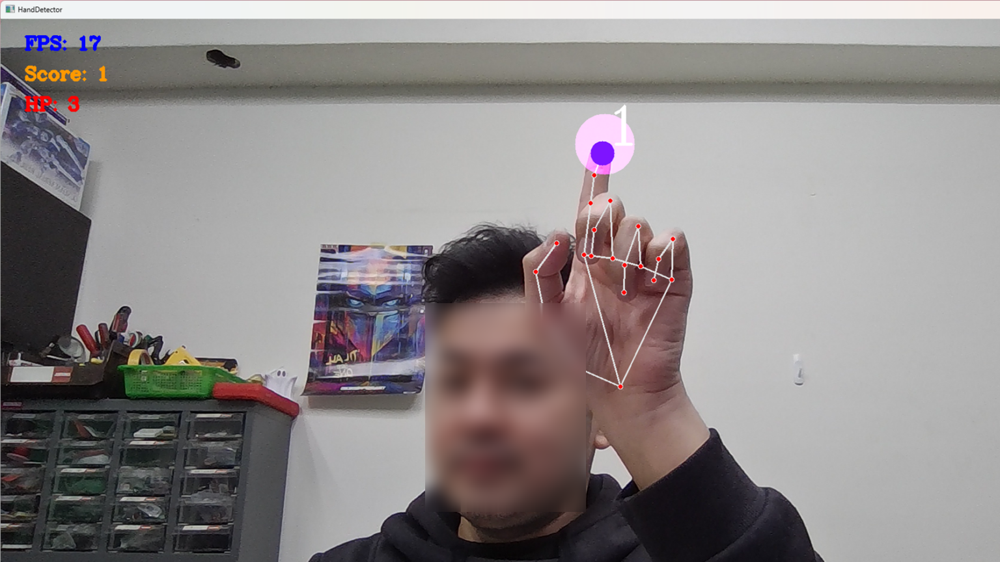

# Gesture-Controlled Game

This is a gesture-based game that uses the MediaPipe library for hand tracking and Pygame for sound effects. The game involves tracking the index finger's tip and interacting with a moving circle on the screen. The player needs to touch the circle to score, with the game displaying a "You Win!" message after three touches.

  


## Requirements

- Python 3.x
- OpenCV
- MediaPipe
- Pygame
- PySerial

## Installation

1. Clone the repository:
   ```bash
   git clone https://github.com/your-username/gesture-control-game.git
